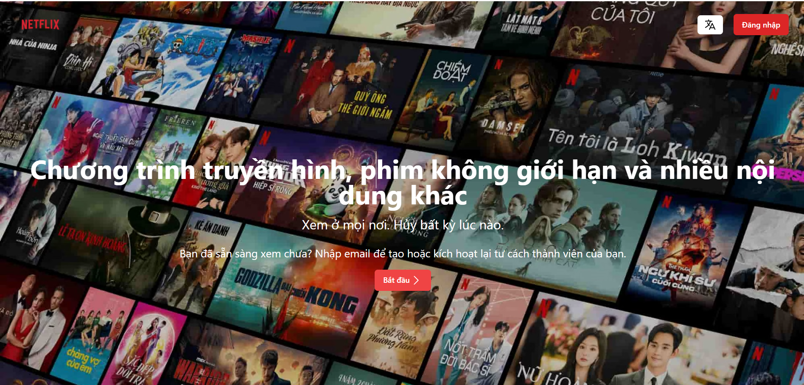
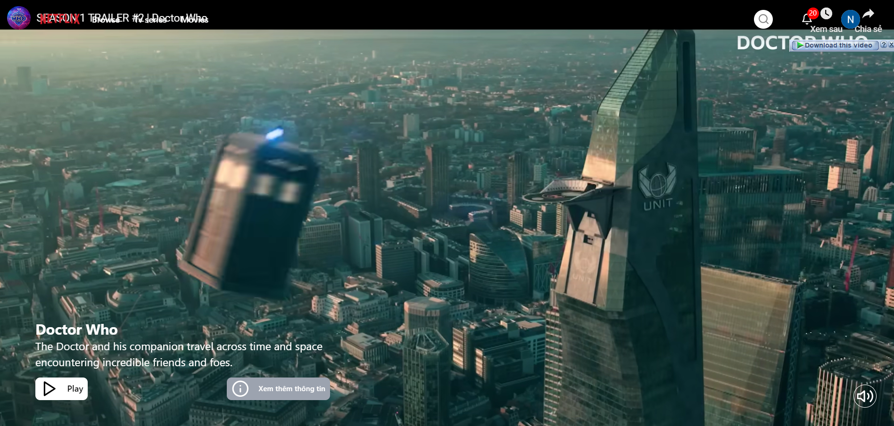
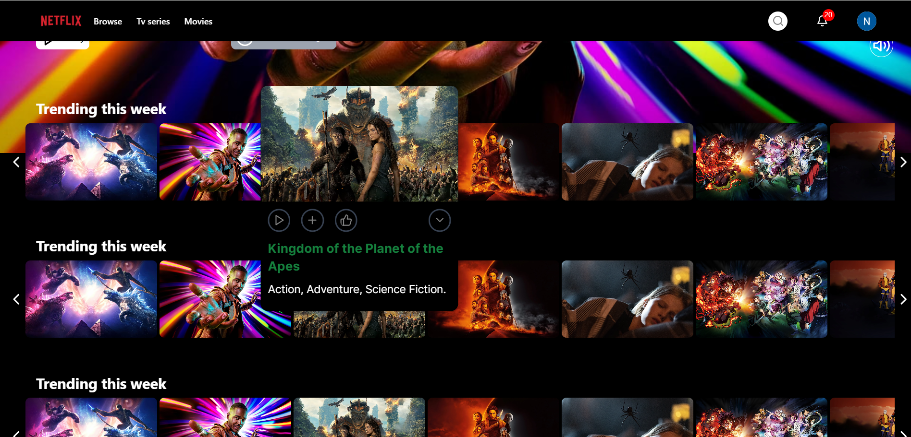

# Netflix Clone
## Introduce

Netflix Clone is a web application that simulates Netflix's main features, including watching movies online, and different movie genres.








## Tech Task
- **ReactJs, NextJs, NodeJS**
## Install 

- **[Node.js](https://nodejs.org/):** version LTS
- **[Docker](https://www.docker.com/):** 
- **[Git](https://git-scm.com/):** 

### Installation Instructions (Hướng dẫn cài đặt)

1. **Clone repository:**
    ```bash
    git clone https://github.com/lnhw/netflix-clone.git
    cd netflix-clone
    ```

2. **Install dependencies (Cài đặt phụ thuộc):**
    ```bash
    npm install
    ```

## Guide 

### Star 

- **Local development:**
    ```bash
    npm run dev
    ```

- **Production build:**
    ```bash
    npm run build
    npm start
    ```

### Access the application (Truy cập ứng dụng)

- **URL:** `http://localhost:3000`

## Project structure (Cấu trúc dự án)

- **src/**: Mã nguồn chính của dự án.
- **components/**: Các thành phần giao diện.
- **app/**: Các trang của ứng dụng.
- **public/**: Tài nguyên tĩnh. 
- **styles/**: Các tệp CSS/SCSS.
